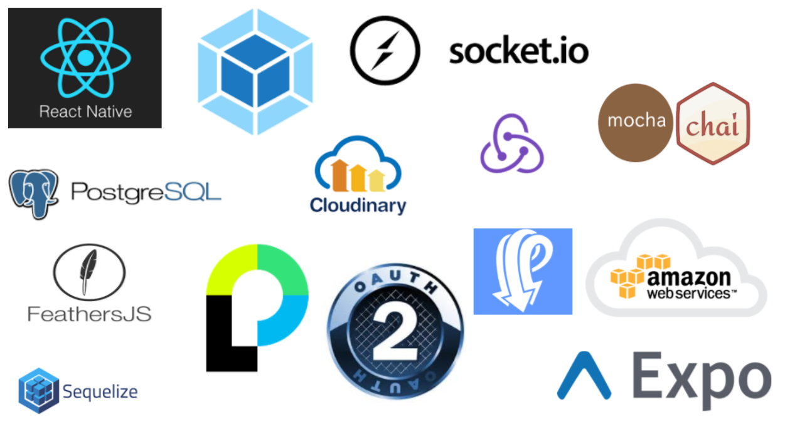

# ClassMate

> An app to make students life easier.

## Team

  - __Product Owner__: Hunter Ledet
  - __Scrum Master__: Lily Lebec
  - __Development Team Members__: Gareth Veitch , Andrew Winstead

## Table of Contents

1. [Usage](#Usage)
1. [Requirements](#requirements)
1. [Development](#development)
    1. [Installing Dependencies](#installing-dependencies)
    1. [Tasks](#tasks)
1. [Team](#team)
1. [Contributing](#contributing)

## Usage

>-
>-
>-

## Requirements

- Node 0.10.x
- 
- 

## Development

### Installing Dependencies

From within the root directory:

```
npm install
```

## Tech Stack
